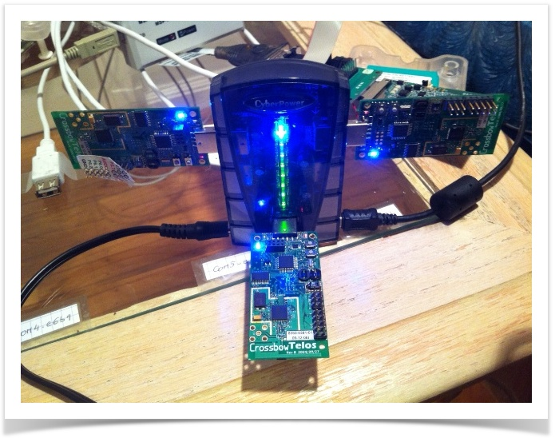

# OpenWSN Docker
  
[OpenWSN](https://github.com/openwsn-berkeley) is an open source project created at the University of California Berkley, which implements wireless RPL(Routing Protocol for Lossy Network) protocols, such as TSCH or 6P, useful for IoT network. However, its dependencies are becoming obsolete(Python 2...) and some are conflicting. This OpenWSN image is built for the ease of use without struggling to install those old dependencies.

## Packages
This image is based on the following packages and dependencies.
```plain
- Ubuntu 18.10
- Python 2.7
- OpenWSN
    - firmware : REL-1.24.0
    - visualizer: REL-1.4.0
    - CoAP: (pip) openwsn-coap 0.0.7
```

## Prerequisites
- Enable IPv6 on Docker 🔗 [Enable IPv6 Support](https://docs.docker.com/config/daemon/ipv6/)  
- Docker Compose 🔗 [Installing Docker Compose](https://docs.docker.com/compose/install/)  
- (Optional) Wireshark 🔗 [Installing Wireshark](https://www.wireshark.org/docs/wsug_html_chunked/ChapterBuildInstall.html)  

## How to build


## Usecase


## Tweaks
These are changes made to the source code in order to run and monitor packets between motes(devices)

## Issues
- Windows devices not portable into Linux containers

## Note
- The current image is tailored to the personal use (zsh, modified requirements etc.)

